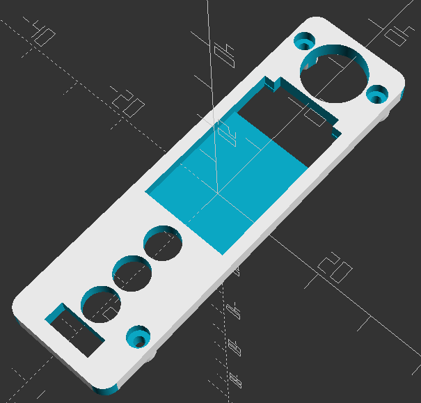

# Board Holder
### A 3D Board Holder for the DNA250C chipset from Evolv

This repository will contain the OpenSCAD files as well as STL/AMF exports of the parts needed to print the part yourself.

- [The Main Body](DNA250C_Board_Holder.stl)

# A 3D Board Holder for the DNA250C chipset from [Evolv](https://evolvapor.com)
