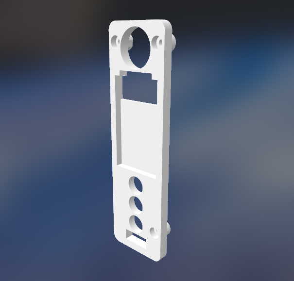

# Board Holder
### A 3D Board Holder for the DNA250C chipset from Evolv

This repository will contain the OpenSCAD files as well as STL/AMF exports of the parts needed to print the part yourself.

You may need to place the BOSL folder in your OpenSCAD library folder.

- [The Main Body STL](DNA250C_Board_Holder.stl)
- [The Main Body AMF](DNA250C_Board_Holder.amf)

# A 3D Board Holder for the DNA250C chipset from [Evolv](https://evolvapor.com)
